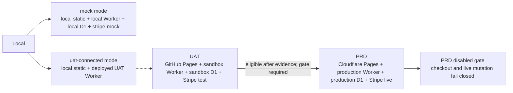
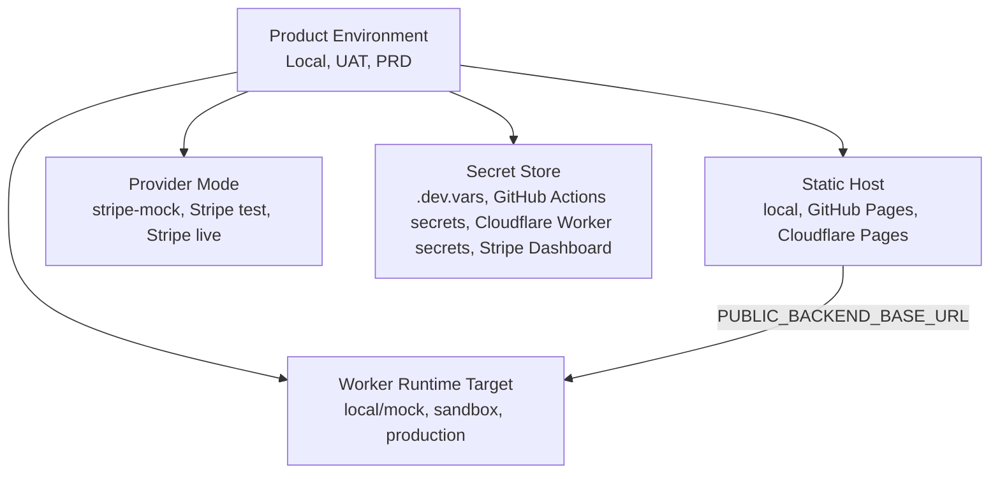
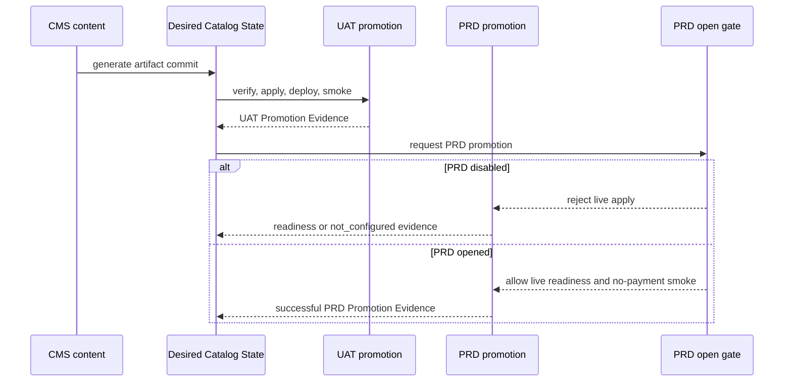

## Context

The repo currently has several names that sound like environments but live at different layers:

- Static frontend hosts: GitHub Pages and Cloudflare Pages.
- Worker runtime targets: local default, `mock`, `mock-api`, `sandbox`, and `production` in Wrangler.
- Provider modes: Stripe test mode and Stripe live mode.
- CI credential scopes: GitHub Actions environments such as `catalog-promotion-uat` and `catalog-promotion-production`.
- Local modes: local stripe-mock, local Stripe test mode, and deployed sandbox/UAT smoke scripts.

That split was already partly real. GitHub Pages plus the sandbox Worker already functioned as UAT for checkout testing, while Cloudflare Pages was the intended production static host. What changes now is that this becomes the only product environment model, and the other names stop competing with it.

External platform constraints checked during planning:

- GitHub Pages custom workflows deploy prebuilt artifacts through `actions/deploy-pages`, with an Actions environment used for deployment protection and URL reporting.
- Cloudflare Pages Direct Upload supports deploying a prebuilt folder from GitHub Actions through Wrangler and requires Cloudflare credentials in CI secrets.
- Wrangler environments remain a valid way to deploy distinct Worker runtime targets and bind environment-specific D1 databases, vars, and secrets.
- Cloudflare Worker secrets and GitHub Actions secrets remain secret stores. `@t3-oss/env-core` validates process/local env contracts, but it is not a secret store.

Current repo evidence:

- `.github/workflows/pages.yml` already deploys the static artifact to GitHub Pages.
- `.github/workflows/cloudflare-pages.yml` deploys the static artifact to Cloudflare Pages and currently allows branch-style deploys through the `pages/**` trigger and `--branch=${{ github.ref_name }}`.
- `.github/workflows/cloudflare-sandbox.yml` deploys the sandbox Worker from the `sandbox` branch.
- `.github/workflows/catalog-promotion.yml` has UAT and production promotion jobs, but the production leg is currently named and reachable as a target.
- `apps/backend/wrangler.jsonc` has a usable `sandbox` Worker target and an incomplete `production` target.
- `apps/backend/wrangler.jsonc` currently mixes local, GitHub Pages UAT, Cloudflare Pages PRD, and a Cloudflare Pages preview URL in `CHECKOUT_RETURN_ORIGINS` for local/mock/sandbox targets.
- `scripts/stripe-catalog-contract.ts` defaults catalog Product image URL generation to `https://blackbox-studio-athens.github.io/blackbox-records/`, and generated `DesiredCatalogState` / Product Projection code currently embeds GitHub Pages asset URLs.
- `@t3-oss/env-core` is currently used only by `scripts/check-stripe-test-checkout.ts`.
- `automate-cms-catalog-promotion` still has pending production provider proof tasks, and `production-go-live-readiness` still describes production launch gates. This change must reconcile those active changes so PRD is not both "disabled" and "ready to mutate live providers" in parallel.
- `openspec/specs/static-site-and-deployment/spec.md` currently has a Purpose line that names Cloudflare Pages deployment and GitHub Pages rollback. Requirement deltas alone may not remove stale Purpose wording during implementation or archive.

## Goals / Non-Goals

**Goals:**

- Define exactly three product environments: Local, UAT, and PRD.
- Make UAT the only GitHub Pages-hosted static site.
- Make PRD the only Cloudflare Pages-hosted static site, with PRD commerce disabled until production readiness is explicitly opened.
- Keep Local simple with exactly two supported operator modes:
  - `mock`: no real provider writes, local Worker, local D1, stripe-mock.
  - `uat-connected`: local frontend pointed at deployed UAT Worker/API for verification and debugging.
- Preserve the useful UAT/PRD separation without proliferating names.
- Define where secrets live and where env validation libraries apply.
- Add validation tasks that detect drift back toward ambiguous environment naming.

**Non-Goals:**

- Do not complete the environment migration in this change plan.
- Do not rename Cloudflare Worker services or D1 databases unless a later implementation task proves the rename is worth the operational churn.
- Do not make PRD buyable or enable live production checkout.
- Do not replace Cloudflare Worker secrets, GitHub Actions secrets, or Stripe Dashboard credentials with `@t3-oss/env-core`.
- Do not add a second frontend runtime or move static frontend behavior into Worker/Pages Functions.

## Decisions

### Decision 1: Product Environment is the only user-facing environment axis

The canonical product environments are:

| Product Environment | Mode / Surface  | Static frontend                    | Worker/API                                  | D1                    | Stripe/provider mode | Commerce state                             |
| ------------------- | --------------- | ---------------------------------- | ------------------------------------------- | --------------------- | -------------------- | ------------------------------------------ |
| Local               | `mock`          | `127.0.0.1:4321/blackbox-records/` | local Worker `mock`; `mock-api` is an alias | local D1              | stripe-mock          | Enabled for deterministic development only |
| Local               | `uat-connected` | local static frontend              | deployed UAT Worker                         | UAT D1 through Worker | Stripe test via UAT  | Verification/debug only                    |
| UAT                 | deployed site   | GitHub Pages                       | sandbox Worker                              | sandbox D1            | Stripe test mode     | Enabled for acceptance testing             |
| PRD                 | deployed site   | Cloudflare Pages                   | production Worker                           | production D1         | Stripe live mode     | Disabled until go-live gate opens          |

`mock` and `uat-connected` are Local modes, not additional product environments.

Rationale: The team can reason in one product vocabulary while still using provider-native names where required. This keeps the model simple without forcing high-risk resource renames.

Alternative considered: rename all Wrangler and script targets from `sandbox`/`production` to `uat`/`prd`. That reads cleaner but risks breaking Worker secrets, D1 bindings, workflows, and existing evidence paths. The safer plan is aliases and docs first, then optional provider resource renames only if they prove useful.

### Decision 2: GitHub Pages becomes UAT, not rollback production

GitHub Pages SHALL be the UAT static host. Cloudflare Pages SHALL be the PRD static host. The old wording that describes GitHub Pages as rollback/legacy is removed from the target model.

Rationale: The repo already uses GitHub Pages with the sandbox Worker for sandbox/UAT checkout testing. Making it official removes the duplicate mental model of "GitHub Pages as both UAT and rollback."

Alternative considered: keep GitHub Pages as rollback while adding a separate UAT host. That adds another public URL and another workflow, which works against the requested simplification.

### Decision 3: PRD exists but fails closed

PRD can have a Cloudflare Pages site and production Worker configuration, but checkout and catalog promotion must fail closed until a dedicated production-readiness change opens PRD. The Cloudflare Pages PRD static deploy remains allowed as a disabled storefront/readiness surface; pausing the static deploy is not the default plan.

Fail-closed means:

- Production checkout capability returns disabled unless `native_checkout_enabled` is deliberately enabled for PRD.
- Production catalog apply cannot run from default/manual promotion unless an explicit PRD-open gate is present.
- Production Worker deploy/config verification may exist as readiness work, but live provider mutation and live checkout availability remain blocked.
- Cloudflare Pages PRD static deploy may continue from the approved workflow, provided the deployed browser surface cannot make live checkout buyable before the PRD-open gate.
- Cloudflare Pages branch/preview deploys are not product environments. The implementation must either remove those triggers or mark them as non-product diagnostics that cannot become UAT acceptance, PRD readiness, or shopper-facing commerce evidence.
- PRD evidence before the PRD-open gate is limited to readiness, disabled, or `not_configured` evidence. It must not be named or interpreted as successful PRD Promotion Evidence.

Rationale: This allows setup to progress without accidentally making live commerce active.

Alternative considered: delete/ignore PRD until launch. That hides missing D1/secrets/origin work until the riskiest moment.

Alternative considered: pause Cloudflare Pages PRD deployments entirely. That reduces public surface area, but it also removes the exact disabled production shell that needs readiness verification. The default plan keeps static deployment active and disables commerce capability instead.

Alternative considered: keep Cloudflare Pages branch deploys as a general preview environment. That preserves a convenient diagnostic surface, but it conflicts with the simplified model unless it is explicitly non-product, non-commerce evidence, and excluded from UAT/PRD acceptance gates.

### Decision 4: Local has two supported modes

Local mode names become:

- `mock`: the default local stack, powered by local Worker, local D1, and stripe-mock.
- `uat-connected`: local static frontend pointed at deployed UAT Worker/API.

The existing local Stripe test stack is not the product default. It may remain as an operator/provider diagnostic command, but it is outside the simplified day-to-day Local model unless a later implementation explicitly keeps it. In `uat-connected`, provider writes are not local writes: any checkout/session creation happens through the deployed UAT Worker and must be triggered only by explicitly named UAT checkout/smoke commands.

Rationale: Most local development needs deterministic mock behavior or a way to inspect UAT from local code. A separate real Stripe test local mode is useful but complicates the default mental model.

Alternative considered: keep `stripe-test` as a third official Local mode. That preserves all current commands but violates the requested "local in two modes" target.

### Decision 5: Secret stores stay provider-native

Sensitive values stay in:

- Local ignored files such as `apps/backend/.dev.vars` for local-only secrets.
- Cloudflare Worker secrets for deployed Worker runtime secrets.
- GitHub Actions secrets/environments for CI deploy credentials and promotion credentials.
- Stripe Dashboard/Workbench for Stripe-side credentials and webhook endpoint secrets.

`@t3-oss/env-core` is used only to validate local/process env contracts in Node scripts or launcher/preflight code. It can parse, require, and redact validation output, but it must not be described as storing, syncing, or rotating secrets.

Rationale: This matches the security boundary of each platform and explains why sensitive information must be re-entered per store. Re-entry is required because the secret stores are intentionally isolated: a local `.dev.vars` value is not automatically available to GitHub Actions, Cloudflare Workers, or Stripe, and copying it through code/docs would create a leak.

Alternative considered: centralize secrets into one repo-managed file or generated config. That is simpler to type once but unsafe for deployed systems and incompatible with provider secret boundaries.

### Decision 6: Promotion language changes externally before internals change

Operator-facing promotion targets become `uat` and `prd`. Internal adapters may still call scripts with `--env sandbox` or `--env production` while those scripts are migrated.

Rationale: This gives users the simple model immediately while allowing incremental implementation. Validation should flag newly introduced user-facing `sandbox` or `production` wording where `uat` or `prd` is intended.

Alternative considered: change every internal type and file name in one pass. That creates a high-blast-radius rename across generated catalog state, evidence paths, workflows, scripts, and docs.

### Decision 7: Frontend-to-Worker wiring follows the matrix

`PUBLIC_BACKEND_BASE_URL`, `CHECKOUT_RETURN_ORIGINS`, browser CORS origins, and Stripe Checkout return URLs are environment-boundary controls, not convenience lists. They must follow the product matrix:

- Local `mock`: local static origins call the local mock Worker and return only to local static origins.
- Local `uat-connected`: local static origins call the deployed UAT Worker and are allowed only as a named local diagnostic path.
- UAT: GitHub Pages calls the UAT Worker; the UAT Worker accepts GitHub Pages UAT origins and the explicit local `uat-connected` origins only.
- PRD: Cloudflare Pages calls the PRD Worker; the PRD Worker accepts Cloudflare Pages PRD origins and approved PRD custom domains only.
- Preview/branch deploys are excluded from checkout return origins unless a later OpenSpec change gives them a specific non-product diagnostic command that cannot become UAT/PRD evidence.

Rationale: clean names are not enough if the browser can still call the wrong Worker or if Stripe can return to a surface outside the product matrix.

Alternative considered: keep a broad shared allowlist across local, UAT, PRD, and previews. That is easy while switching surfaces, but it preserves the ambiguity this change is meant to remove and weakens the PRD-disabled gate.

### Decision 8: Catalog public asset URLs are target-scoped

Stripe Product image URLs are part of catalog promotion, not neutral static content. Generated catalog contracts, Desired Catalog State, Product Projections, verification output, and Promotion Evidence must use public asset URLs that match the target product environment:

- UAT catalog artifacts use the GitHub Pages UAT asset base.
- PRD catalog readiness/live artifacts use the Cloudflare Pages PRD asset base or an approved PRD custom domain asset base.
- Local mock may use local or UAT-stable assets only for deterministic diagnostics, and that output must not become PRD Promotion Evidence.

PRD readiness before the PRD-open gate may dry-run and validate Cloudflare Pages PRD asset URLs, but it must not mutate live Stripe Products. A live Stripe Product must not be created or updated with a GitHub Pages UAT image URL unless a later OpenSpec change explicitly approves GitHub Pages as the shared canonical asset CDN.

Rationale: once a Product image URL is written into Stripe, it becomes visible provider state. If live products receive UAT-hosted GitHub Pages image URLs while PRD is defined as Cloudflare Pages, the simplified environment model still leaks through catalog data even if checkout origins are correct.

Alternative considered: use GitHub Pages as one stable asset host for every environment. That is simpler, but it contradicts the UAT/PRD host split unless the team explicitly promotes GitHub Pages to a shared asset CDN role.

## Diagrams

### Product Environment Model

### Naming Layers

### Promotion Gates

## Risks / Trade-offs

- Product names differ from provider names -> Mitigation: add a maintained mapping table and validation that prevents new user-facing ambiguity.
- Keeping Wrangler `sandbox` may still confuse maintainers -> Mitigation: scripts and docs expose `uat` while internal adapters own the mapping.
- PRD disabled but configured can look "almost live" -> Mitigation: require explicit disabled-state checks in capabilities, smoke tests, and promotion evidence.
- PRD readiness evidence could be mistaken for successful promotion evidence -> Mitigation: require evidence status categories that distinguish readiness-only, disabled, not-configured, opened, and successful PRD promotion.
- Local UAT-connected mode could accidentally mutate UAT -> Mitigation: default it to read/smoke behavior and require explicitly named UAT mutation commands for any write path.
- Secret re-entry remains manual -> Mitigation: document the reason and provide redacted preflight checks that prove presence without printing values.
- Removing local Stripe test from the official day-to-day model might hide a useful diagnostic -> Mitigation: keep it as an operator/provider diagnostic unless a later task intentionally retires it.

## Migration Plan

1. Add the `environment-model` baseline spec and update language specs.
2. Update static deployment docs and AGENTS wording:
   - GitHub Pages = UAT.
   - Cloudflare Pages = PRD.
   - PRD is disabled until go-live.
3. Add a single environment matrix document or README section used by docs, scripts, and validation output.
4. Update workflow naming:
   - Keep existing job mechanics.
   - Rename operator-facing target `production` to `prd`.
   - Rename GitHub Actions environment `catalog-promotion-production` to `catalog-promotion-prd` only after its secrets are recreated.
5. Add PRD-disabled guards to catalog promotion and production checkout readiness.
6. Add local `uat-connected` launcher/preflight that points the static site at deployed UAT Worker/API and does not need copied UAT secrets locally.
7. Add validation commands that prove:
   - UAT frontend deploys only through GitHub Pages.
   - PRD frontend deploys only through Cloudflare Pages.
   - PRD live checkout/promotion is disabled.
   - PRD evidence before the PRD-open gate cannot be classified as successful Promotion Evidence.
   - `PUBLIC_BACKEND_BASE_URL`, `CHECKOUT_RETURN_ORIGINS`, and browser CORS origins match the Local/UAT/PRD matrix without broad cross-environment allowlists.
   - Local supported modes are exactly `mock` and `uat-connected` for normal development.
   - env validation library usage is limited to local/process env contracts.
8. Reconcile active production-facing changes:
   - Update `automate-cms-catalog-promotion` pending production proof tasks so they are blocked by or renamed under the PRD-open gate.
   - Update `production-go-live-readiness` so it is the PRD-open gate owner rather than a competing production environment model.
9. Remove or explicitly demote Cloudflare Pages branch/preview deploys so they cannot be used as UAT, PRD, promotion evidence, or shopper-facing commerce surfaces.
10. Update docs that still say GitHub Pages rollback/legacy or Cloudflare Pages canonical production without PRD-disabled state.
11. Before archiving, re-read affected baseline specs and update stale Purpose/source-of-truth prose that OpenSpec requirement deltas do not automatically rewrite.

Rollback strategy:

- Because the first implementation should be docs/specs/workflow guards before resource renames, rollback is a normal git revert.
- If a GitHub Actions environment is renamed, keep the old environment paused until the new `catalog-promotion-prd` environment has the same required secrets, variables, and protection rules verified.
- Do not delete old Cloudflare Worker secrets or D1 resources during this migration.

## Open Questions

- What exact name should the GitHub Actions deployment environment use for GitHub Pages UAT: keep `github-pages` for platform compatibility or introduce a separate `uat` protection environment?
- Should the current `dev:stack:stripe-test` command remain documented as an advanced diagnostic after the two-mode Local model is implemented?
- Should future custom domains use `uat.<domain>` and apex/www for PRD, or keep provider domains until commerce is production-ready?
